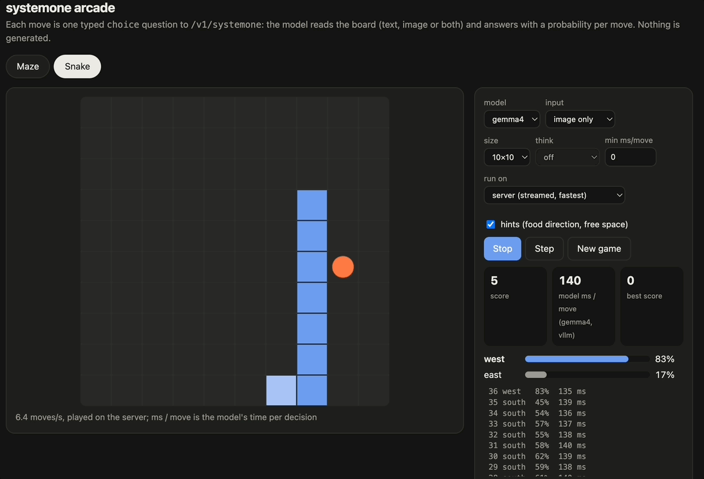

<h1 align="center">System One</h1>

<p align="center">
  
</p>


[Jev](https://typesafe.ai/blog/introducing-system-one-models-and-jev) and [Laya](https://github.com/NandhaKishorM/laya) are awesome but they don't yet support images or video. This project extends TypeSafe Jev's `/v1/systemone` typed-decision API (`noul` / `choice` / `score`, with
probabilities) on **any LLM served by vLLM or SGLang or OpenRouter (Experimental)**.
- **Multimodal understanding comes for free.** With vision enabled models like gemma 4 or qwen 3.5 - the typed decisions endpoint supports images / video / audio, Jev or Laya **doesn't** support images or video yet.
- **The latency and accuracy is comparable to Jev and Laya** - and in some cases better on self hosted models.
- This approach builds a zero-shot classification wrapper around existing decoder only models, enabling us to use them for typed-decision tasks. 
- Therefore the existing world knowledge of these models is preserved, and we can use them for typed-decision tasks.
- Experimental support for finetuning with RLCD objective to improve accuracy.

## Results

| model | typed acc | ECE (cal) | AG News | ms / case | req/s |
|---|---|---|---|---|---|
| **Gemma 4 31B (zero-shot)** | 0.709 | 0.105 | 0.867 | 81 | 62 |
| Gemma 4 31B + CE LoRA² | **0.791** | 0.154 | 0.840 | 164 | 56 |
| Gemma 4 31B + RLCD LoRA² | 0.785 | 0.145 | 0.827 | 165 | 55 |
| Gemma 4 31B (zero-shot) via OpenRouter³ | 0.697 | 0.093 | 0.827 | 1,820 | 15 |
| **Qwen3.5-35B-A3B (zero-shot)** | 0.672 | 0.091 | 0.837 | 206¹ | 35 |
| **gpt-oss-20b (zero-shot)** | 0.597 | 0.055 | 0.583 | 42 | **189** |
| gpt-oss-20b (zero-shot) + `think: 64` | 0.626 | 0.077 | 0.860 | 304 | 40 |
| DiffusionGemma 26B-A4B (zero-shot) | 0.666 | 0.089 | 0.817 | 153 | 34 |
| Laya, zero-shot | 0.362 | **0.026** | **0.933** | **32** | – |
| *Laya, fine-tuned (published)* | *0.766* | *0.213* | *0.953* | – | – |
| *TypeSafe Jev 1.13 (published)* | *0.727* | *0.144* | *0.910* | *710* | – |

- **typed acc**: accuracy on typed-decisions (2,000 decisions).
- **ECE (cal)**: calibration error after the per-model temperature fit (lower is better).
- **ms / case**: p50 for a 5-question typed-decisions case.
- **req/s**: 4-question requests per second with 32 in flight.

² Fine-tuned on the typed-decisions train split with `systemone rlcd train` (LoRA,
RLCD objective), so like Laya fine-tuned they are not zero-shot.

³ Hosted, through OpenRouter's chat API with the default per-question read (see
[OpenRouter](#openrouter)); latency is mostly the network hop and the provider's queue.

Jev figures are third-party published, not measured here, so treat them as indicative.
Laya's zero-shot 0.362 matches its own published 0.361 on the same split, which
cross-checks the scoring.

## Quick start

```bash

git clone https://github.com/infinitylogesh/systemone.git
pip install -e ./systemone            # standard library only

# already running `vllm serve <model>`? put systemone in front of it:
# upstream is the url of the vllm / sglang server
# Important: log probs should be enabled in sglang / vllm config for this to work.
systemone serve --upstream http://localhost:8000

# or start both at once:
systemone launch Qwen/Qwen3.5-35B-A3B-FP8 -- --gpu-memory-utilization 0.85
```

### OpenRouter (Experimental)

No GPU: serve a model hosted on [OpenRouter](https://openrouter.ai), alone or next to
local upstreams:

```bash
export OPENROUTER_API_KEY=sk-or-...
systemone serve --openrouter gemma4-openrouter=google/gemma-4-31b-it \
  --calibration-dir calibration --demo
```

OpenRouter has no tokenizer and its providers don't continue a prefilled reply, so the
answer-slot read isn't available. The model answers instead, and the probabilities come
from the top-20 logprobs at its answer token, matched to the labels by text.
`--openrouter-read` picks how:

| `--openrouter-read` | requests per case | typed acc | ECE (cal) | cost / 1k cases |
|---|---|---|---|---|
| `per_question` (default) | 1 per question, `max_tokens: 1`: closest to the answer-slot read | 0.707 | 0.098 | ≈ $0.30 |
| `single` | 1: the model writes an `id: label` line per question | 0.697 | 0.093 | ≈ $0.07 |

Only providers that return logprobs can serve (for Gemma 4 31B: CoreWeave, Parasail,
Novita); the probe checks each with a request and orders them by speed, or pass
`--openrouter-providers`. Images work, `think`, video and audio don't. Temperatures:
`calibration/gemma4-openrouter.json` (per_question) and
`gemma4-openrouter-single.json` (serve the single read under that name). Details:
[how_it_works.md](how_it_works.md#openrouter-hosted-models-no-gpu).

### Example Request

```bash
curl -s localhost:8011/v1/systemone -H 'content-type: application/json' -d '{
  "model": "<model_name>",
  "state": {"body": "We were billed twice for March. Refund it today or we cancel."},
  "questions": {
    "department": {"type": "choice", "instructions": "Which team handles this?",
                   "criteria": {"billing": "payments, refunds", "technical": "bugs", "other": null}},
    "urgency": {"type": "score", "instructions": "How urgent?", "criteria": ["low", "medium", "high"]},
    "churn": {"type": "noul", "instructions": "Does the customer threaten to leave?"}
  }
}'
```

Tested on **Gemma 4**, **Qwen3.5**, **gpt-oss** : each started with `systemone launch <model>`

## How it works

The details are in [how_it_works.md](how_it_works.md).

## Calibration

Raw LLM probabilities are often overconfident: Gemma 4 averages 0.99 confidence while
being right 62% of the time on Emotion. `systemone bench` fits one temperature per
(question type, option count) on labelled data. `systemone serve --calibration file.json`
applies them, and re-reads the file when it changes. An option count without its own fit
uses the same question type's fit at the nearest count. Temperatures fitted on the
typed-decisions train split for every tested model are in [`calibration/`](calibration/).

## Fine-tuning (RLCD)

`systemone rlcd prepare` builds training data with the serving stack's own tokens, and
`systemone rlcd train` fine-tunes the answer-label distribution with LoRA on top of TRL
(`--objective rlcd | proper | ce`). On Gemma 4 31B it lifts typed-decisions accuracy from
0.702 to 0.79 and Brier from 0.111 to 0.041. Plain cross-entropy did as well as the RL
objective. See [RLCD.md](RLCD.md).

## Demos

`systemone serve --demo` also serves `/studio` (camera, motion, audio) and `/arcade`
(maze, snake). Setup, eval scripts and measured numbers: [demo/README.md](demo/README.md).

## Benchmark

```bash
pip install datasets
systemone bench --backend mymodel=http://localhost:8011 --out results.json --calibration-dir cal/
systemone report results.json        # markdown table incl. Jev's published row
```

Suites:
- `features`: 31 request cases covering types, state shapes, 6 languages, `depends_on`,
  `ask_if`, `think`, images and validation.
- `public`: AG News, DAIR Emotion, SST-2.
- `typed`: [LocalLLaMA/typed-decisions](https://huggingface.co/datasets/LocalLLaMA/typed-decisions),
  400 cases and 2,000 decisions, scored the same way as Jev's published numbers.
- `latency`: sequential p50 and a concurrency sweep.

Any endpoint that speaks `/v1/systemone` can be benchmarked; add `,basic` for a backend
that only implements Jev's core contract.


**Takeaways**
- **Zero-shot LLMs through systemone land near Jev on typed-decisions:** Gemma 4 0.709 vs
  0.727. Only the typed-decisions fine-tune of Laya (0.766) is more accurate.
- **With a fitted temperature, every tested LLM has lower ECE than Jev** (0.055–0.105 vs
  0.144). Gemma 4 and Qwen3.5 also beat it on Brier (0.105 and 0.095 vs 0.148) and on
  score MAE.
- **Latency per 5-question case:** gpt-oss, DeepSeek and Gemma 4 take 42–81 ms against
  Jev's published 710 ms, **9–17× faster**. Qwen3.5 takes 206 ms (3.4×, see ¹).
- **Pick by constraint:**
  - Gemma 4 31B for accuracy;
  - Qwen3.5 for calibration out of the box (raw ECE 0.033, no fitting needed);
  - gpt-oss-20b for throughput (189 req/s, 42 ms per case);
  - gpt-oss with `think: 64` when its quality matters more.
- **Reasoning-trained models need a little thinking.** Read with no reasoning, gpt-oss
  guesses: it puts ~50% on the last option regardless of content. `think: 64` lifts AG News
  from 0.583 to 0.860 at ~290 ms. The answer position itself is fine: 99.6% of the
  probability lands on legal labels (`examples/diagnose_slot.py`).

## Credits:

- [mmastrac](https://github.com/mmastrac) and his vLLM PR [57250](https://github.com/vllm-project/vllm/pull/57250) - His work on extending diffusion gemma model to support system one api is the original inspiration for this work to extend system one api for decoder only models.
- [Laya](https://github.com/NandhaKishorM/laya) - For opensourcing the zero-shot classification with encoder-only model approach and fine-tuning on typed-decisions.

## Limitations

- **Labels must be one token.** That limits `choice` to 26 options and `score` to 26
  levels; the server rejects anything else with a clear 422.
- **Question order.** Questions in `independent` mode don't see each other's answers; use
  `depends_on` or `mode: "joint"` where they should.
- **Images** go through the chat endpoint. For Gemma the prompt then lacks the empty
  thought block, a minor difference from the text path.
